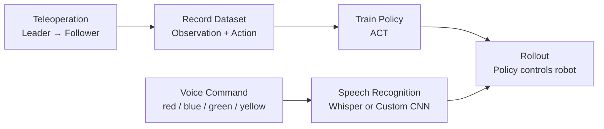

# SO-101 Voice-Controlled Imitation Learning

Voice-controlled pick-and-place system for the **SO-101 robot arm**, built on top of [🤗 LeRobot](https://github.com/huggingface/lerobot).

The robot learns manipulation tasks from human demonstrations (Imitation Learning with the **ACT** policy). Multiple trained policies are then combined into one system, and the user selects which task to run simply by saying a command such as **"red"**, **"blue"**, **"green"** or **"yellow"**.

> Developed at **Physical AI Lab (PAI Lab), University of Ulsan**.

---

## Table of Contents

- [Overview](#overview)
- [Hardware Requirements](#hardware-requirements)
- [Software Requirements](#software-requirements)
- [1. Installation](#1-installation)
- [2. Robot Setup](#2-robot-setup)
- [3. Teleoperation](#3-teleoperation)
- [4. Hugging Face Setup](#4-hugging-face-setup)
- [5. Record a Dataset](#5-record-a-dataset)
- [6. Inspect the Dataset](#6-inspect-the-dataset)
- [7. Train a Policy](#7-train-a-policy)
- [8. Rollout (Run the Policy)](#8-rollout-run-the-policy)
- [9. Voice Control](#9-voice-control)
- [Project Structure](#project-structure)
- [Troubleshooting](#troubleshooting)
- [Acknowledgements](#acknowledgements)

---

## Overview

The project follows the standard Imitation Learning pipeline, extended with a voice-command layer:



| Term | Meaning |
| --- | --- |
| **Task** | The goal the robot must accomplish, e.g. *"Pick and place the red cube"*. |
| **Episode** | One complete demonstration of a task, from start to completion. |
| **Observation** | What the robot perceives: follower joint states (`observation.state`, 6-DOF) and camera images (`observation.images.*`). |
| **Action** | Target joint positions for the next step (`action`, 6-DOF), taken from the leader arm during recording. |
| **Policy** | The trained model that maps Observation → Action. |

In this project, **four tasks** are trained, one per colored cube (red, blue, green, yellow). Each task has its own policy, and the voice module selects which one to run.

---

## Hardware Requirements

- 2 × **SO-101 robot arms**: one **Leader** (moved by hand) and one **Follower** (the robot that performs the task)
- 2 × **Bus Servo Adapter** boards (one per arm), each driving six **Feetech STS3215** servos
- 2 × **power supplies** (USB does **not** power the servos)
- 2 × **USB-C to USB-A** cables
- 1–2 × **USB cameras** (e.g. a front view and a top view)
- 1 × **microphone** (for voice control)
- Clamps to fix both arms to the table
- A PC with an **NVIDIA GPU** (recommended for training)

## Software Requirements

- **Ubuntu** (tested on Ubuntu Linux)
- **Miniconda / Anaconda**
- **Python 3.12**
- **FFmpeg** (installed through conda below)
- A **Hugging Face** account

---

## 1. Installation

> 💡 In the Ubuntu terminal, use `Ctrl + Shift + C` to copy and `Ctrl + Shift + V` to paste.

### 1.1 Create a virtual environment

```bash
conda create -y -n lerobot python=3.12
conda activate lerobot
```

### 1.2 Install FFmpeg

FFmpeg is used to record camera footage, encode it into the dataset, and decode it during training.

```bash
conda install ffmpeg -c conda-forge
```

### 1.3 Clone this repository

```bash
git clone https://github.com/Thach2001-git/SO101-Voice-Control-Imitation-Learning.git
cd SO101-Voice-Control-Imitation-Learning
```

### 1.4 Install dependencies

```bash
pip install --upgrade pip
pip install -e ".[core_scripts]"
pip install -e ".[training]"
pip install -e ".[feetech]"
pip install -e ".[all]"
```

| Extra | Purpose |
| --- | --- |
| `core_scripts` | Core LeRobot command-line tools |
| `training` | Dependencies for model training |
| `feetech` | Driver for the Feetech servos used by SO-101 |
| `all` | All optional features |

The `-e` flag installs the package in **editable mode**, so any change to the source code takes effect immediately without reinstalling.

### 1.5 Install voice-control dependencies

```bash
sudo apt install alsa-utils      # microphone recording tools
pip install openai-whisper       # Whisper speech recognition (Approach 1)
```

---

## 2. Robot Setup

### 2.1 Mount and wire the arms

1. Clamp **both ends** of each robot base firmly to the table so the arms cannot tip or vibrate.
2. Leave enough free space around the robots.
3. For **each arm**, connect:
   - the **motor cable** to the controller board,
   - a **power supply** to the controller board,
   - a **USB-C → USB-A** cable from the controller board to the PC.

### 2.2 Find the USB port of each arm

```bash
lerobot-find-port
```

When prompted with `Remove the USB cable from your MotorsBus and press Enter when done`, unplug **one** arm and press `Enter`. The tool prints the port of the arm you unplugged. Plug it back in and repeat for the other arm.

Example result (used throughout this README):

| Arm | Port |
| --- | --- |
| Leader | `/dev/ttyACM0` |
| Follower | `/dev/ttyACM1` |

> ⚠️ Replace these ports in every command below if yours are different.

### 2.3 Grant access to the ports

```bash
sudo chmod 666 /dev/ttyACM0
sudo chmod 666 /dev/ttyACM1
```

> This permission resets whenever the USB is reconnected or the PC restarts. To make access permanent, add your user to the `dialout` group once, then log out and back in:
>
> ```bash
> sudo usermod -aG dialout $USER
> ```

### 2.4 Calibrate the arms

Calibration maps raw servo positions to real joint angles, so the Follower reproduces the Leader's motion accurately.

For each arm:
1. Move the arm to the **middle of its range of motion** and press `Enter`.
2. Move **every joint except `wrist_roll`** slowly through its **full range** (minimum → maximum).
3. Press `Enter` to finish.

**Follower arm (calibrate first):**

```bash
lerobot-calibrate \
    --robot.type=so101_follower \
    --robot.port=/dev/ttyACM1 \
    --robot.id=my_awesome_follower_arm
```

**Leader arm:**

```bash
lerobot-calibrate \
    --teleop.type=so101_leader \
    --teleop.port=/dev/ttyACM0 \
    --teleop.id=my_awesome_leader_arm
```

Calibration files are saved to `~/.cache/huggingface/lerobot/calibration/`. Keep using the **same `id`** in later commands so the calibration is reused.

### 2.5 Find the cameras

```bash
lerobot-find-cameras opencv
```

Note the index of each camera (e.g. `/dev/video0` → index `0`, `/dev/video2` → index `2`). Test images are saved to `outputs/captured_images`.

| Camera class | Supported devices |
| --- | --- |
| `OpenCVCamera` | USB webcams, laptop cameras, phones |
| `RealSenseCamera` | Intel RealSense (with depth) |
| `ZMQCamera` | Network cameras |
| `Reachy2Camera` | Reachy 2 robot cameras |

---

## 3. Teleoperation

Control the Follower by moving the Leader by hand. This is a good check that ports, calibration and cameras all work before recording data.

```bash
lerobot-teleoperate \
    --robot.type=so101_follower \
    --robot.port=/dev/ttyACM1 \
    --robot.id=my_awesome_follower_arm \
    --robot.cameras="{ front: {type: opencv, index_or_path: 0, width: 640, height: 480, fps: 30}, up: {type: opencv, index_or_path: 2, width: 640, height: 480, fps: 30} }" \
    --teleop.type=so101_leader \
    --teleop.port=/dev/ttyACM0 \
    --teleop.id=my_awesome_leader_arm \
    --display_data=true
```

A log line such as `Teleop loop time: 16.76ms (60 Hz)` means teleoperation is running.

---

## 4. Hugging Face Setup

Datasets and trained models are stored on the [Hugging Face Hub](https://huggingface.co).

### 4.1 Create an account and an access token

1. Sign up at [huggingface.co](https://huggingface.co/join) and verify your email.
2. Go to **Settings → [Access Tokens](https://huggingface.co/settings/tokens) → + Create new token**.
3. Choose the **Write** token type (required for uploading; it cannot be changed later).
4. Give it a descriptive name, e.g. `lerobot-upload`.
5. **Copy the token immediately.** It starts with `hf_` and is shown only once.

> 🔒 Never commit your token to GitHub or share it publicly.

### 4.2 Log in from the terminal

```bash
git config --global credential.helper store
hf auth login --token <YOUR_HF_TOKEN> --add-to-git-credential
hf auth whoami
```

### 4.3 Set your username variable

```bash
export HF_USER=<your_hf_username>
echo $HF_USER
```

> Run this again in every new terminal, or add the `export` line to your `~/.bashrc`.

---

## 5. Record a Dataset

### 5.1 How recording works

Recording repeats a **Record → Reset → Record** cycle:

1. **Recording episode N**: perform the task with the Leader arm.
2. **Reset the environment**: put the object back at its starting position.
3. Repeat until `num_episodes` is reached. The dataset is then encoded and uploaded to the Hub automatically.

### 5.2 Start recording

```bash
conda activate lerobot
export HF_USER=<your_hf_username>

lerobot-record \
    --robot.type=so101_follower \
    --robot.port=/dev/ttyACM1 \
    --robot.id=my_awesome_follower_arm \
    --robot.cameras="{ front: {type: opencv, index_or_path: 0, width: 640, height: 480, fps: 30}, up: {type: opencv, index_or_path: 2, width: 640, height: 480, fps: 30} }" \
    --teleop.type=so101_leader \
    --teleop.port=/dev/ttyACM0 \
    --teleop.id=my_awesome_leader_arm \
    --display_data=true \
    --dataset.repo_id=${HF_USER}/red_cube \
    --dataset.num_episodes=20 \
    --dataset.single_task="Pick and Place the red cube" \
    --dataset.streaming_encoding=true \
    --dataset.encoder_threads=2
```

Record **one dataset per task**. For this project, repeat the command with `red_cube`, `blue_cube`, `green_cube` and `yellow_cube`, changing `--dataset.single_task` to match each time.

### 5.3 Key parameters

| Parameter | Description |
| --- | --- |
| `--robot.type / port / id` | Follower arm configuration |
| `--robot.cameras` | Camera names, indices, resolution and FPS |
| `--teleop.type / port / id` | Leader arm configuration |
| `--display_data` | Show camera feeds and joint data live during recording |
| `--dataset.repo_id` | Dataset name on the Hub: `<user>/<dataset_name>` |
| `--dataset.single_task` | Text description of the task |
| `--dataset.num_episodes` | Number of episodes to record |
| `--dataset.episode_time_s` | Duration of each episode, in seconds |
| `--dataset.reset_time_s` | Duration of the reset period, in seconds |
| `--dataset.streaming_encoding` | Encode video while recording |
| `--dataset.encoder_threads` | Number of threads for video encoding |

### 5.4 Keyboard controls during recording

| Key | Action |
| --- | --- |
| `→` or `n` | End the current episode or reset period early and move on |
| `←` or `r` | Discard the current episode and re-record it |
| `Esc` or `q` | Stop the session, encode the videos, and upload the dataset |

### 5.5 Resume recording

To add more episodes to an existing dataset, re-run the same command with `--resume=true` and the local dataset path:

```bash
lerobot-record \
    --robot.type=so101_follower \
    --robot.port=/dev/ttyACM1 \
    --robot.id=my_awesome_follower_arm \
    --robot.cameras="{ front: {type: opencv, index_or_path: 0, width: 640, height: 480, fps: 30}, up: {type: opencv, index_or_path: 2, width: 640, height: 480, fps: 30} }" \
    --teleop.type=so101_leader \
    --teleop.port=/dev/ttyACM0 \
    --teleop.id=my_awesome_leader_arm \
    --display_data=true \
    --dataset.repo_id=${HF_USER}/red_cube \
    --dataset.root="$HOME/.cache/huggingface/lerobot/${HF_USER}/red_cube" \
    --dataset.num_episodes=10 \
    --dataset.single_task="Pick and Place the red cube" \
    --dataset.streaming_encoding=true \
    --dataset.encoder_threads=2 \
    --resume=true
```

> When resuming, `--dataset.num_episodes` is the number of **additional** episodes to record.

---

## 6. Inspect the Dataset

| Location | Path |
| --- | --- |
| Local PC | `~/.cache/huggingface/lerobot/<HF_USER>/<dataset_name>/` (contains `data/`, `meta/`, `videos/`) |
| Hugging Face Hub | `https://huggingface.co/datasets/<HF_USER>/<dataset_name>` |

On the Hub dataset page you can:
- browse frames and values in the **Dataset Viewer**,
- click **Visualize this dataset** to replay episodes with video,
- open `meta/info.json` to check FPS, features and shapes.

Main dataset fields:

| Field | Type | Description |
| --- | --- | --- |
| `action` | `float32[6]` | Leader arm joint positions (target) |
| `observation.state` | `float32[6]` | Follower arm joint positions (current) |
| `observation.images.<camera>` | video | RGB frames from each camera |

---

## 7. Train a Policy

Train one **ACT** policy per task:

```bash
lerobot-train \
    --dataset.repo_id=${HF_USER}/red_cube \
    --policy.type=act \
    --output_dir=outputs/train/red_cube_act \
    --job_name=red_cube_act \
    --policy.device=cuda \
    --wandb.enable=false \
    --policy.repo_id=${HF_USER}/red_cube_act \
    --save_checkpoint_to_hub=true \
    --steps=300
```

| Parameter | Description |
| --- | --- |
| `--dataset.repo_id` | Dataset used for training |
| `--policy.type` | Policy architecture (`act`) |
| `--output_dir` | Local folder for checkpoints and logs |
| `--job_name` | Name of the training run |
| `--policy.device` | `cuda` for GPU, `cpu` otherwise |
| `--wandb.enable` | Log to Weights & Biases (`true` / `false`) |
| `--policy.repo_id` | Where the trained model is uploaded on the Hub |
| `--save_checkpoint_to_hub` | Also push intermediate checkpoints to the Hub |
| `--steps` | Number of training steps |

> ⚠️ `--steps=300` is only a quick test to check that everything runs. A usable policy needs far more steps; increase it for real training.

For this project, use these output folders so the voice-control scripts can find the models:

```
outputs/train/red_cube_act
outputs/train/blue_cube_act
outputs/train/green_cube_act
outputs/train/yellow_cube_act
```

### Resume training

**From a local checkpoint:**

```bash
lerobot-train \
    --config_path=outputs/train/red_cube_act/checkpoints/last/pretrained_model/train_config.json \
    --resume=true
```

**From the Hugging Face Hub:**

```bash
lerobot-train \
    --config_path=${HF_USER}/red_cube_act \
    --resume=true
```

`--resume=true` restores the optimizer, scheduler, step counter and data order from the latest checkpoint.

---

## 8. Rollout (Run the Policy)

Run a trained policy on the Follower arm to check how well it performs the task:

```bash
lerobot-rollout \
    --strategy.type=base \
    --policy.path=${HF_USER}/red_cube_act \
    --robot.type=so101_follower \
    --robot.port=/dev/ttyACM1 \
    --robot.id=my_awesome_follower_arm \
    --robot.cameras="{ front: {type: opencv, index_or_path: 0, width: 640, height: 480, fps: 30}, up: {type: opencv, index_or_path: 2, width: 640, height: 480, fps: 30} }" \
    --task="Pick and Place the red cube" \
    --duration=60
```

> `--policy.path` accepts a Hub model ID or a local folder such as `outputs/train/red_cube_act/checkpoints/last/pretrained_model`. Camera names and indices must match the ones used during recording.

---

## 9. Voice Control

Once all four policies are trained, the voice module listens for a color and launches the matching policy automatically.

Two speech-recognition approaches are provided:

| | Approach 1: Whisper | Approach 2: Custom Voice Model |
| --- | --- | --- |
| Model | OpenAI Whisper (pre-trained) | VoiceCNN trained on your own recordings |
| Extra training | None | Record voice samples and train |
| Strengths | Simple and flexible | Adapted to your voice and environment |
| Script | `voice_recognition_whisper.py` | `voice_recognition.py` |

### 9.1 Configure the policy paths

Before running either script, open it and check that the paths and task descriptions match your trained models:

```python
POLICY_PATHS = {
    "red":    REPO_ROOT / "outputs/train/red_cube_act/checkpoints/last/pretrained_model",
    "blue":   REPO_ROOT / "outputs/train/blue_cube_act/checkpoints/last/pretrained_model",
    "yellow": REPO_ROOT / "outputs/train/yellow_cube_act/checkpoints/last/pretrained_model",
    "green":  REPO_ROOT / "outputs/train/green_cube_act/checkpoints/last/pretrained_model",
}

TASK_DESCRIPTIONS = {
    "red":    "Pick and Place the red cube",
    "blue":   "Pick and Place the blue cube",
    "yellow": "Pick and Place the yellow cube",
    "green":  "Pick and Place the green cube",
}
```

Also check the hardware section of the script (`ROBOT_TYPE`, ports and cameras) so it matches your wiring.

### 9.2 Approach 1: Whisper

```bash
python voice_recognition_whisper.py
```

1. Wait for `Ready. Press Enter and say a command (red / blue / yellow / green).`
2. Press `Enter` and say a color into the microphone.
3. If a color is recognized, you will see `=> Detected color: GREEN` and the matching policy starts.
4. If nothing is recognized, you will see `No color detected`. Press `Enter` and try again.
5. Press `Ctrl + C` to quit.

### 9.3 Approach 2: Custom Voice Model

**Step 1: Record voice samples**

```bash
python record_voice_dataset.py
```

For each word (red, blue, yellow, green), press `Enter` and say the word clearly when prompted. The script records **30 samples per word**, with a 2-second interval between samples. Files are saved to:

```
voice_dataset/
├── red/     red_000.wav ... red_029.wav
├── blue/
├── yellow/
└── green/
```

**Step 2: Train the voice classifier**

```bash
python train_voice_classifier.py
```

The trained model is saved as `voice_classifier.pt` in the repository root.

**Step 3: Run voice control**

Check that `MODEL_PATH` in `voice_recognition.py` points to your trained model:

```python
MODEL_PATH = REPO_ROOT / "voice_classifier.pt"
```

Then run:

```bash
python voice_recognition.py
```

It works the same way as the Whisper version: press `Enter`, say a color, and the robot runs the matching task.

---

## Project Structure

Files added on top of LeRobot for this project:

```
SO101-Voice-Control-Imitation-Learning/
├── src/lerobot/                    # LeRobot framework source
├── voice_recognition_whisper.py    # Voice control using Whisper
├── voice_recognition.py            # Voice control using the custom VoiceCNN
├── record_voice_dataset.py         # Record voice samples for each command
├── train_voice_classifier.py       # Train the VoiceCNN classifier
├── voice_classifier.pt             # Trained voice classifier
├── voice_dataset/                  # Recorded voice samples (created by script)
└── outputs/train/                  # Trained robot policies (created by training)
```

---

## Troubleshooting

<details>
<summary><b>Build error while running <code>pip install -e</code></b></summary>

Install a compatible CMake version, then retry:

```bash
conda install -c conda-forge cmake=3.28
```
</details>

<details>
<summary><b>FFmpeg / video encoding errors (<code>libsvtav1</code> missing, torchcodec version mismatch)</b></summary>

Check the available encoders:

```bash
ffmpeg -encoders | grep svtav1
```

If `libsvtav1` is missing or the version conflicts with torchcodec, install FFmpeg 7.1.1:

```bash
conda install ffmpeg=7.1.1 -c conda-forge
```
</details>

<details>
<summary><b><code>Permission denied</code> on <code>/dev/ttyACM*</code></b></summary>

```bash
sudo chmod 666 /dev/ttyACM0
sudo chmod 666 /dev/ttyACM1
```

For a permanent fix, run `sudo usermod -aG dialout $USER` and log out and back in.
</details>

<details>
<summary><b>Leader and Follower ports are swapped</b></summary>

Ports can change after unplugging or rebooting. Run `lerobot-find-port` again and update the ports in your commands.
</details>

<details>
<summary><b>Camera not found or wrong camera opens</b></summary>

Run `lerobot-find-cameras opencv` again and update `index_or_path` in `--robot.cameras`. Make sure the camera names (`front`, `up`) are the same for recording, training and rollout.
</details>

<details>
<summary><b>Voice command always returns "No color detected"</b></summary>

- Check that the microphone is selected as the input device in Ubuntu **Settings → Sound**.
- Test recording with `arecord -d 3 test.wav && aplay test.wav`.
- Speak clearly right after pressing `Enter`, and reduce background noise.
- For the custom model, record more samples in the environment where you will use the robot.
</details>

<details>
<summary><b><code>HF_USER</code> is empty</b></summary>

The variable only exists in the current terminal. Run `export HF_USER=<your_hf_username>` again, or add it to `~/.bashrc`.
</details>

---

## Acknowledgements

- [🤗 LeRobot](https://github.com/huggingface/lerobot) by Hugging Face, the robot learning framework this project is built on (Apache-2.0 License).
- [OpenAI Whisper](https://github.com/openai/whisper) for speech recognition.
- **Physical AI Lab (PAI Lab), University of Ulsan.**
